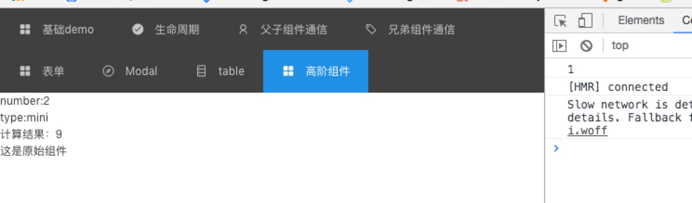

# React 高阶组件
## 为什么需要高阶组件？
- 这个问题很简单，为什么我们需要react/vue/angular？使用框架最核心的原因之一就是提高开发效率，能早点下班。同理，react高阶组件能够让我们写出更易于维护的react代码，能再早点下班~
- 举个栗子，ES6支持使用import/export的方式拆分代码功能和模块，避免一份文件里面出现"成坨"的代码。同理对于复杂的react组件，如果这个组件有几十个自定义的功能函数，自然要进行拆分，不然又成了"一坨"组件，那么该如何优雅地拆分组件呢？react高阶组件应运而生

## 高阶组件是什么？
- 我们写代码需要进行加法计算，于是我们把加法计算的方法单独抽出来写成一个加法函数，这个加法函数可以在各处调用使用，从而减少了工作量和代码量。而我们独立出来的这个可以随处使用的加法函数，类比地放在react里，就是高阶组件。
- 所以React的思考方法就是要从 `Component`=> `Function`转变.  本质上高阶组件就是高阶函数,   写法也要从class=> Function 转变.

## 怎样实现高阶组件
### 属性代理
- 第一种方法属性代理是最常见的实现方式，将被处理组件的props和新的props一起传递给新组件，代码如下：

```js
//WrappedComponent为被处理组件
function HOC(WrappedComponent){
    return class HOC extends Component {
        render(){
            const newProps = {type:'HOC'};
            return <div>
                <WrappedComponent {...this.props} {...newProps}/>
            </div>
        }
    }
}

//@HOC
class OriginComponent extends Component {
    render(){
        return <div>这是原始组件</div>
    }
}
const newComponent = HOC(OriginComponent)

```

使用属性代理的好处就是，可以把常用的方法独立出来并多次复用。比如我们实现了一个加法函数，那么我们把加法函数改造成形如上述HOC函数的形式，之后对其他组件进行包裹，就可以在组件里使用这个方法了。

### 反向继承

我们先来看一段代码

```js
function HOC(WrappedComponent){
  return class HOC extends WrappedComponent {
      //继承了传入的组件
      constructor(){
        super()
        this.state={
          number:2,
          type:'mini'
        }
      }
      test1(){
          return this.test2() + 5;
      }
      componentDidMount(){
          console.log('1');
      }
      render(){
          //使用super调用传入组件的render方法
          // super.render 中 this 指向的对象是 this
          return super.render();
      }
  }
}
//this
//@HOC
class OriginComponent extends Component {
  constructor(props){
    super(props);
    this.state = {
      number:1,
      type:'Big'
    }
  }
  test2(){
      return 4;
  }
  componentDidMount(){
    console.log('2');
  }
  render(){
      return (
        <div>
            <div>number:{this.state.number}</div>
            <div>type:{this.state.type}</div>
          <div>
            计算结果：{this.test1()}
          </div>
            这是原始组件
        </div>
      )
  }
}

const NewComponent = HOC(OriginComponent);

//const newComponent = HOC(OriginComponent)

```
- 代码看完我们可能还有点懵，那我们先来剖析关键词"继承"。何谓继承？新生成的HOC组件通过extends关键字，获得了传入组件OriginComponent所有的属性和方法，是谓"继承"。也就是说继承之后，HOC组件能够实现OriginComponent组件的全部功能，而且，HOC可以拿到state和props进行修改，从而改变组件的行为，也就是所谓的"渲染劫持"。可以说，通过反向继承方法实现的高阶组件相比于属性代理实现的高阶组件，功能更强大，个性化程度更高，适应更多的场景。

结果如图




- this.test1()输出了9。为什么？
因为在ES6中，super作为对象调用父类方法时，super绑定子类的this。故执行super.render()时OriginComponent中的this指向的是HOC组件，所以能够成功地执行test1函数。

- 控制台输出的是1而不是2。为什么？
首先，decorator是在代码编译阶段执行，故HOC的render方法在OriginComponent的render方法之前执行。并且子组件HOC是继承于父组件OriginComponent，两者具有继承关系`HOC.__proto__ `=== OriginComponent，当执行componentDidMount方法时，子组件已存在该方法，故执行完毕后结束，不再根据`__proto__`向上继续寻找。如果我们将子组件HOC中的componentDidMount方法去掉，那么控制台将输出2

## pureRender 实现

```js
import { is } from 'immutable';
function shouldComponentUpdate(nextProps, nextState) {
  if (nextProps == null) {
    nextProps = {};
  }
  if (nextState == null) {
    nextState = {};
  }
  const thisProps = this.props || {};
  const thisState = this.state || {};
  if (
    Object.keys(thisProps).length !== Object.keys(nextProps).length ||
    Object.keys(thisState).length !== Object.keys(nextState).length
  ) {
    return true;
  }

  let index = 0;
  const propsKeys = Object.keys(nextProps);

  for (; index < propsKeys.length; index++) {
    const key = propsKeys[index];
    if (
      thisProps[key] !== nextProps[key] &&
      !is(thisProps[key], nextProps[key])
    ) {
      return true;
    }
  }

  const stateKeys = Object.keys(nextState);
  for (index = 0; index < stateKeys.length; index++) {
    const key = stateKeys[index];
    if (
      thisState[key] !== nextState[key] &&
      !is(thisState[key], nextState[key])
    ) {
      return true;
    }
  }
  return false;
}
export default function(component) {
  component.prototype.shouldComponentUpdate = shouldComponentUpdate;
  return component;
}

```