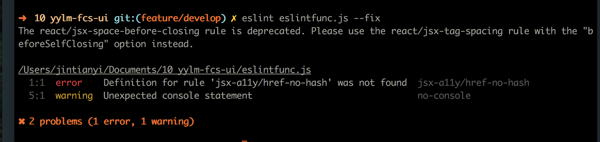

# 前端规范

ESLint 是一个插件化的 javascript 代码检测工具，它可以用于检查常见的 JavaScript 代码错误，辅助编码规范的执行，有效控制项目代码的质量。

[官方地址](http://eslint.org/docs/user-guide/getting-started)

[中文网](http://eslint.cn/docs/user-guide/configuring)

针对demo项目整理了安装步骤以及规范，配合编辑器的格式化插件使用。

## 安装 eslint

1.  打开你滴项目 `cd yourproject`

2.  全局安装 eslint `sudo npm i -g eslint`

3.  再全局装一下其他用到的插件

    ```sh
    sudo npm eslint-plugin-import  eslint-plugin-react  babel-eslint --save-dev
    ```

4.  项目根目录下新建.eslintrc.js 文件，把附录中的代码放进去

5.  测试一下有没有安装成功，比如

    ```sh
      eslint eslintfunc.js
    ```

    

6.  代码格式化

    执行 `eslint eslintfunc.js --fix` 是可以直接修复一些常见的问题，比如去掉文件中的 debugger 等，[在这个页面](http://eslint.cn/docs/rules/)，一些带黄色扳手的图标，是可以自动修复的
    

    这时候打开你的 eslintfunc.js 文件，可以看到一些简单的错误被修复了

## 编辑器插件配合使用

### Sublime Text

1.  安装插件 `SublimeLinter` `ESlint-formatter`

2.  在项目.eslintrc.js 中配置规则

3.  重新打开 sublime,即可看到如图
4.  利用 `ESlint-formatter` 格式化 如图

### WebStorm

1.  打开设置（File>Setting），按路径进入 ESLint 的配置界面（Languages&Frameworks>JavaScript>Code Quality Tools>ESLint;开启 ESLint
    如图 
2.  在项目.eslintrc.js 中配置规则
3.  重新打开 webstorm,即可看到 如图
4.  右键，利用 `Fix Eslint Problems` 格式化 如图 

### VScode

1.  推荐安装`eslint`
    如图 
2.  打开 Preferences > 用户设置直接搜 eslint， 可以看到 eslint 的默认配置，可修改配置


    ```json
    {
      "workbench.iconTheme": "vscode-icons",
      "files.autoSave": "afterDelay",
      "editor.tabSize":2,
      "path-intellisense.extensionOnImport": true,
      "path-intellisense.autoSlashAfterDirectory": true,
      "npm-intellisense.importES6": true,
      "window.zoomLevel": 1,
      "editor.fontSize": 14,
      "projectManager.groupList": true,
      "explorer.confirmDelete": false,
      "eslint.autoFixOnSave": true,
    }
    ```

3.  随便打开一个文件看到如图 
    在 save 时 可 autoFix 一些不符合规则的代码

### Atom

1.  打开 Atom -> Preferences -> install
    安装`linter` `linter-eslint` `eslint-fixer`
2.  在 `linter-eslint` 配置；
    * 把 Disable when no ESLint config is found 的对勾去掉
    * 把 Use global ESLint installation 的对勾勾上
3.  重启 Atom 可看到如图 
4.  右键执行 Eslint Fix 可以自动 fix 一些不符合规则的代码如图 

## 配置脚本

在根目录的 package.json 文件中 配置命令：

```json
 "scripts": {
   "lint:js": "eslint --ext .jsx,.js  ./app --fix"
 }
```

可通过运行 `npm run lint:js` 来测试是否配置成功。

## 项目启动时检查代码

在 webpack 中配置,在运行 `npm run start` 时候会强制 eslint 会检测代码

安装 `eslint-loader`

```javascript
module: {
  rules: [
    {
      test: /\.js[x]?$/,
      enforce: "pre",
      include: [path.join(process.cwd(), "/app/")],
      exclude: [path.join(process.cwd(), "/node_modules/")],
      use: [
        {
          loader: "eslint-loader",
          options: {
            emitWaring: true,
            emitError: true
          }
        }
      ]
    }
  ];
}
```

## 编译前检查代码

添加一下脚本，编译前会检查一遍代码

```json
script:{
  "prebuild": "npm run build:clean && npm run lint:js"
 }
```

## 提交前再检查一次

安装 [pre-commit](https://github.com/observing/pre-commit)

在 package.json 文件中，添加提交前的代码检查

```json
"pre-commit": ["lint:js"]
```

## 附录：feteam 的代码规范配置

```javascript
module.exports = {
  // 解析器，识别es6 中的新语法，不然箭头函数，async等识别成错误
  parser: "babel-eslint",
  // 当访问未定义的变量时，no-undef 规则将发出警告
  // 指定脚本的运行环境。每种环境都有一组特定的预定义全局变量
  env: {
    browser: true,
    node: true,
    jest: true,
    es6: true
  },
  parserOptions: {
    // ECMAScript版本，7为ES7
    ecmaVersion: 7,
    sourceType: "module",
    //使用额外的语言特性
    ecmaFeatures: {
      impliedStrict: true,
      jsx: true,
      experimentalObjectRestSpread: true
    }
  },
  // eslint-plugin-react 识别react 中的语法
  //eslint-plugin-import 识别 import/export 语法
  plugins: ["eslint-plugin-react", "eslint-plugin-import"],
  // 当访问未定义的变量时，no-undef 规则将发出警告
  // 脚本在执行期间访问的额外的全局变量
  globals: {
    go: true,
    swal: true,
    CodeMirror: true,
    $: true
  },
  rules: {
    //eslint rules
    //Possible Errors
    //这些规则与 JavaScript 代码中可能的错误或逻辑错误有关

    "no-cond-assign": 2,
    //控制判读错误

    "no-console": 0,

    "no-constant-condition": 2,
    //禁止在条件中使用常量表达式

    "no-debugger": 2,

    "no-dupe-args": 2,
    //函数参数不能重复

    "no-dupe-keys": 2,
    //创建对象字面量时不允许键重复

    "no-duplicate-case": 2,
    //switch中的case标签不能重复

    "no-empty": 2,
    //块语句中的内容不能为空

    "no-ex-assign": 2,
    //禁止给catch语句中的异常参数赋值

    "no-extra-semi": 2,

    "no-func-assign": 2,
    //禁止重复的函数声明

    "no-invalid-regexp": 2,
    //禁止错误的正则

    "no-irregular-whitespace": 2,
    //不能有不规则的空格

    "no-regex-spaces": 2,
    //禁止在正则表达式字面量中使用多个空格

    "no-template-curly-in-string": 2,
    //模版字符串检查

    "no-unexpected-multiline": 2,
    //避免令人误解的多行表达式

    "valid-typeof": 2,

    //Best Practices
    //这些规则是关于最佳实践的，帮助你避免一些问题

    complexity: [2, 10],
    //回路复杂度

    curly: [2, "all"],
    //控制大括号的写法

    "no-lone-blocks": 2,
    //禁止 不必要的块嵌套

    "no-multi-spaces": 2,

    "default-case": 2,
    //switch 语句要有 default

    "dot-location": [2, "property"],
    //对象访问符的位置，换行的时候在行首

    "no-caller": 2,
    //禁止使用arguments.caller或arguments.callee

    "no-div-regex": 2,
    //不能使用看起来像触发的正则表达式

    "no-empty-function": 2,
    //不能有空函数

    "no-extend-native": 2,

    "no-fallthrough": 2,
    //禁止switch穿透

    "no-floating-decimal": 2,
    //禁止省略浮点数中的0

    "no-proto": 2,

    "no-redeclare": 2,
    //禁止重复声明变量

    "no-return-assign": [2, "except-parens"],
    //return 语句中不能有赋值表达式,但是可以在括号

    "no-self-assign": 2,
    //不能自己给自己赋值

    "no-self-compare": 2,
    //不能自身跟自身比较

    "no-sequences": 2,
    //禁止使用逗号运算符

    "no-shadow-restricted-names": 2,
    //严格模式中规定的限制标识符不能作为声明时的变量名使用

    "no-undef": 2,

    //Stylistic Issues
    //关于风格指南的，而且是非常主观

    "array-bracket-spacing": [
      2,
      "always",
      { objectsInArrays: false, arraysInArrays: false, singleValue: false }
    ],
    //强制数组方括号中使用一致的空格

    "comma-spacing": [2, { before: false, after: true }],
    //逗号前不适用逗号，逗号后使用空格

    "func-call-spacing": [2, "never"],
    //禁止在函数标识符和其调用之间有空

    "block-spacing": 2,
    //禁止或强制在代码块中开括号前和闭括号后有空格

    "lines-around-comment": [
      2,
      { beforeBlockComment: true, afterBlockComment: false }
    ],
    //要求在注释周围有空行,注释前有空行，注释后没

    "object-curly-spacing": [
      2,
      "always",
      { arraysInObjects: true, objectsInObjects: true }
    ],
    //强制在花括号中使用一致的空格

    "key-spacing": [2, { beforeColon: false, afterColon: true }],
    //强制在对象字面量的属性中键和值之间使用一致的间距

    "keyword-spacing": [2, { before: true, after: true }],
    //强制关键字前后有空格

    "space-before-blocks": [2, "always"],
    //强制在块之前使用一致的空格

    "space-in-parens": [2, "never"],
    //强制在圆括号内使用一致的空格

    "space-infix-ops": 2,
    //要求操作符周围有空格

    "brace-style": [2, "1tbs"],
    //强制在代码块中使用一致的大括号风格

    semi: [2, "always"],
    //要求或禁止使用分号

    "semi-spacing": [2, { before: false, after: true }],
    //分号前后的空格,

    "no-mixed-spaces-and-tabs": 2,
    //不允许空格和 tab 混合缩进

    "comma-dangle": [2, "never"],
    //不允许对象中出现结尾逗号

    indent: [2, 2],
    //缩进 2

    "no-whitespace-before-property": 2,
    //禁止属性前有空白

    //es6

    "arrow-spacing": [2, { before: true, after: true }],
    //控制箭头函数左右箭头的间距

    "no-this-before-super": 2,
    //禁止在构造函数中，在调用 super() 之前使用 this 或 super

    "no-const-assign": 2,
    //禁止修改 const 声明的变量

    "no-dupe-class-members": 2,
    //禁止类成员中出现重复的名称

    "no-undef": 2,
    //禁用未声明的变量

    //React 风格

    "jsx-quotes": [2, "prefer-single"],
    //强制在 JSX 属性中一致地使用单引号

    "react/jsx-boolean-value": [2, "always"],

    "react/jsx-closing-bracket-location": [2, "line-aligned"],

    "react/jsx-curly-spacing": [2, "never"],

    "react/jsx-indent-props": [2, 2],

    "react/jsx-no-duplicate-props": ["error", { ignoreCase: true }],
    //没有重复的属性

    "react/jsx-no-undef": 2,
    //不能使用未定义的组件

    "react/jsx-pascal-case": 2,
    //对于定义的组件命名，用驼峰

    "react/no-deprecated": 2,
    //检测已丢弃的方法

    "react/no-unknown-property": 2,
    //检测未知的属性

    "react/require-render-return": 2,
    //render 函数要有 return

    "react/jsx-space-before-closing": [2, "always"],

    "react/jsx-equals-spacing": [2, "never"],
    //属性等号前后不要有空格

    "react/jsx-indent": [2, 2],

    "react/no-render-return-value": 2,

    "react/style-prop-object": 2,
    //检测style 属性格式

    "react/prefer-es6-class": [2, "always"]
  }
};
```
