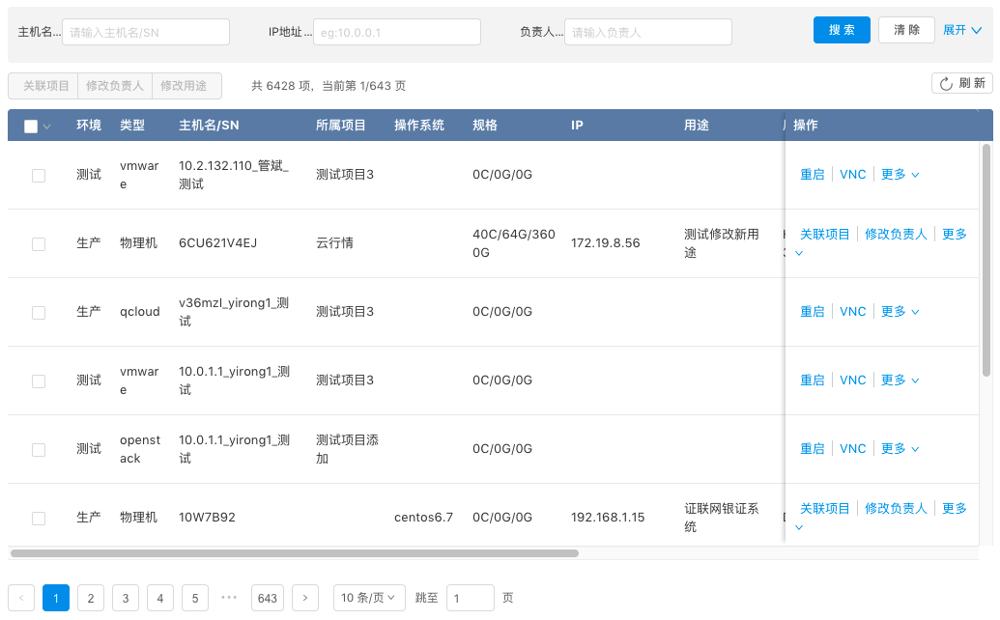

# Table 组件

<!-- toc -->



一个 Table 的组成部分包括

0. Table 定义
1. 搜索过滤组件，可能是简单的模糊搜索，也可能包含高级的复杂搜索
2. 顶级操作：批量执行操作，新增 item 操作
3. 列操作：排序操作、多选操作、过滤操作
4. 行操作：更多展现
5. 分页 Pagination 组件
6. 横向滚动与纵向滚动
7. Table 高度与页面自适应
9. 数据流转实现

## Table 定义

为了能够动态配置 Table 的列，在无需发版的情况下调整列的展现，将 Table 的列数据放在后端存储，前端通过 api 访问获取：

### Schema Api 返回结果定义

```js
{
    "status": "success",
    "item": {
        "columns": [
            {
                "title":  String,
                "dataIndex": String,
                "width": String | Number,
                //"left" | "right"
                "fixed": String, 
                //true|false|"sorter-function-name"
                "sorter": Boolean | String, 
                // "custom-render-name"
                "render": String
            }
        ],
        // data url
        "datasource": String,

        // table 横向滚动
        scrollX: String | Number,

        // table 纵向滚动
        scrollY: String | Number
    }
}
```

### Datasource url 定义
在拿到 table 定义过后再通过 datasource 获取 table 数据，为了能够统一 datasource 的访问行为，需要统一 querys

- `keyword`: 模糊搜索的关键词
- `page`: 当前分页第几页
- `limit`: 当前分页 page size
- `sortField`: 排序列 ,
- `sortOrder`: 排序方式 `descend|ascend`

eg:

`http://datasourceapi?keyword=xxx&query1=xxx&query2=xxx&page=xxx&limit=xxx`


### 数据返回结果定义

```json
{
    "status": "success",
    "message": "message",
    "list": [{}], 
    "meta": {
        "limit": Number,
        "offset" : Number
        "pages" : Number,
        "total" : Number
    }
}
```

数据规范：

- 日期类型：采用 `YYYY-MM-DD HH:mm:ss` Format 

## Table 搜索过滤器

### 过滤器交互规范

1. 模糊搜索情况: 对于模糊搜索的情况，搜索条件采用 `float:right` 的形式
2. 多个搜索: 对于包含多个搜索的情况，使用展开高级搜索的交互方式实现，默认收起，一行包含 3 个搜索条件

### 过滤器代码实现

```html
import React from 'react';
import { Form, Row, Col, Input, Button, Icon, Select, DatePicker} from 'antd';
const FormItem = Form.Item;
const Option = Select.Option;

class AdvancedSearchForm extends React.Component {
    // 搜索 action
    handleSearch = (e) => {
        e.preventDefault();
        this.props.form.validateFields((err, values) => {
            // values.time = values.time.format('YYYY-MM-DD HH:mm:ss')
            this.props.dispatch({
                type: "reducer-name/search",
                payload: values
            });
        })
    }
    
    // 重置搜索
    handleReset = () => {
        this.props.dispatch({
            type: "reducer-name/reset-search"
        })
        this.props.form.resetFields();
    }
    
    // 展开和显示高级搜索
    toggleAdvance = () => {
        this.props.dispatch({
            type: "reducer-name/toggle-advance-search"
        })
    }
    
    // 某些情况下需要手动重置搜索
    componentWillReceiveProps(nextProps) {
        // if should reset search {
            // this.handleReset();
        // }
    }
    
    render() {
        const { getFieldDecorator,getFieldValue } = this.props.form; 
        const formItemLayout = {
          labelCol: { span: 5 },
          wrapperCol: { span: 19 },
        };
    
        // expand 属性通过 props 传递过来
        // 如果未展开，那么使用 input|input|input|button 6*4 布局 
        // 否则使用 input|input|input 8*3 布局 
        const expand = this.props.expand;
        const span = expand ? 8 : 6;

        const children = []
        children.push(
            <Col span={span} key="name">
                <FormItem {...formItemLayout} label={`名称`}>
                  {getFieldDecorator(`name`)(
                    <Input placeholder="name" />
                  )}
                </FormItem>
            </Col>
        )
        
        // 如果未展开，最多只显示 3 个 child
        const shownCount = expand ? children.length : 3;
        const $search = (
            <Col span={expand ? 24 : span} style={{ textAlign: 'right' }}>
              <Button type="primary" htmlType="submit">搜索</Button>
              <Button style={{ marginLeft: 8 }} onClick={this.handleReset}>
                清除
              </Button>
              <a style={{ marginLeft: 8, fontSize: 12 }} onClick={this.toggleAdvance}>
                {expand ? "收起" : "展开"}  <Icon type={expand ? 'up' : 'down'} />
              </a>
            </Col>
        )

        return (
            <Form
                className="ant-advanced-search-form"
                onSubmit={this.handleSearch}
                style={{marginBottom: 10}}
            >
                <Row gutter={40}>
                  {children.slice(0, shownCount)}
                  {!expand ? $search : ""}
                </Row>
                {expand ? (<Row> {$search} </Row> ) : ""}
            </Form> 
        )


    } 
}
export default Form.create()(AdvancedSearchForm);

```

如果搜索条件需要字典，可以在 saga 中获取 table schema 的时候预先将字典加载放到 redux state 中

对于简单的搜索情况

```html
import React from 'react';
import { Form, Row, Col, Input, Button, Icon, Select, DatePicker} from 'antd';
const FormItem = Form.Item;
const Search = Input.Search;
const Option = Select.Option;
const { RangePicker } = DatePicker;
class SearchForm extends React.Component {
  onSearch = (value) => {
    this.props.dispatch({
      type: "reducer-name/search",
      payload: {
        keyword: value
      }
    })
  }
  render() {
    return (
      <div className="contorl-bar" style={{textAlign: "right", marginBottom: 10}}>
        <Search
          placeholder="可输入关键字模糊查询.."
          style={{ width: 200 }}
          onSearch={this.onSearch}
        />
      </div>
    );
  }
}
export default SearchForm;
```

## 顶级操作

### 操作交互规范

1. 批量操作或者新增操作统一放在搜索和 Table 之间的 `Row` 中
2. 新增操作为 `primary` 类 `Button`，其他操作使用 `default` 类
3. 多个操作通过 `ButtonGroup` 合并在一起，超过 5 个以上的操作通过更多操作 `dropdown` 形式展现
4. 刷新类非业务操作 `float:right`

### 操作代码实现

```html
// table-control.js
import React from "react";

import {
  Table,
  Pagination,
  Button,
  Icon,
  Dropdown,
  Menu,
  message,
  Modal
} from "antd";

import actions from "./actions";

class TableControls extends React.Component {
    // 正式执行操作
    execAction = (name, records) => {
        const action = actions[name];
        if (action) {
          action({
            records,
            dispatch: this.props.dispatch
          });
        }
    };
    
    // 执行批量处理操作
    execBatchAction = name => {
        const selectedRows = this.props.selectedRows;
        if (selectedRows.length === 0) {
          return message.warning("请至少选择一行数据");
        }
        this.execAction(name, selectedRows);
    };

    reload = () => {
        this.props.dispatch({
            type: "reducer-name/reload"
        })
    }

    render() {
        const menu = (
          <Menu selectedKeys={[]}>
            <Menu.Item key="0">
              <a onClick={this.execBatchAction.bind(this, "restart")}>重启</a>
            </Menu.Item>
            <Menu.Item key="1">
              <a onClick={this.execBatchAction.bind(this, "associate")}>关联项目</a>
            </Menu.Item>
          </Menu>
        );

        return (
            <div style={{ marginBottom: 10 }}>
              <Button.Group>
                <Button onClick={this.execBatchAction.bind(this, "powerOn")}>
                  开机
                </Button>
                <Button onClick={this.execBatchAction.bind(this, "powerOff")}>
                  关机
                </Button>
                <Dropdown overlay={menu}>
                  <Button>
                    其他操作 <Icon type="down" />
                  </Button>
                </Dropdown>
              </Button.Group>
            
              <span className="pull-right">
                <Button onClick={this.reload} size="small">
                  <Icon type="reload" />刷新
                </Button>
              </span>
            </div>
        )
    }
}

export default TableControls;
```

具体操作 `action` 实现使用 `Popup` 组件，在 `Popup` 中渲染要操作的内容，完成操作过后通过传递进去的 `dispatch` 方法来实现回调，使用 Popup 的好处是 Popup 的渲染独立于当前渲染的根节点，不会对当前页面的渲染结果有任何副作用，而且只会在调用的时候才相关逻辑才会被执行，而不同于直接使用 `Modal` 组件，直接使用 `Modal` 时，生命周期函数会直接开始执行

```html
// actions/access-rel.jsx
import React from 'react'
import {Modal,Row,Col,Button} from 'antd'
import Popup from 'components/popup'
import FormGenerator from 'components/FormGenerator'

class Content extends React.Component{
    render() {
        const records = this.props.records
        return (
            <div className="action-dialog" >
                <div>
                    .......
                </div>
                <div className="ant-modal-footer">
                    <Button onClick={() => {
                            Popup.close();
                        }}> 确定 </Button>
                    </div>
                    <Button onClick={() => {
                        Popup.close();
                    }}> 取消 </Button>
                </div>
            </div>
        );
    }
}

export default function action(props){
    Popup.open({
        title:"互访关系",
        width:"1000",
        content:(
            <Content
                {...props}
                onOk={(ev)=>{
                    props.dispatch({
                        type: "project/reload-current-project-resource"
                    })
                }}/>
        ),
        onCancel:()=>{
            Popup.close()
        }
    })
}
```


## 列操作 

列操作目前基本只有两类，第一类是勾选实现批量操作，第二类是按列排序

### 批量勾选实现

在包含 Table 的组件中定义 `state`

```js
state = {
  selectedRowKeys: [],
  selectedRows: []
}
```

定义 `onSelectChange` 方法

```js
onSelectChange = (selectedRowKeys, selectedRows) => {
  this.setState({ selectedRowKeys, selectedRows });
};
```

渲染 table 的 render 方法内, 定义 `rowSelection` 配置对象传递给 table, 注意，需要指定 `rowKey` ，不然 Antd 无法

```html
render() {
  const rowSelection = {
    // 选中的行
    selectedRowKeys: this.state.selectedRowKeys,

    // Function(selectedRowKeys, selectedRows)
    // 选中项发生变化的时的回调
    onChange: this.onSelectChange,

    // Function(record, selected, selectedRows)
    // 用户手动选择/取消选择某列的回调
    onSelect: this.onSelect
  };

  return (
    <Table 
      rowKey={"id"}
      rowSelection={rowSelection}/>
  )
}
```

### 列排序

列排序的定义在 table schema 的 columns 中配置某一列 
```js
sorter: true
// 或者
// 自定义 sorter 函数名称，因为是后端配置，前端会找到对应名称的函数来替换，如果找不到这个 sorter 函数，那么返回 true
// 对某一列数据进行排序，通过指定列的 sorter 函数即可启动排序按钮。sorter: function(a, b) { ... }， a、b 为比较的两个列数据。
sorter: "sorter function name"
```

监听 sorter 改变事件

```js
// 在 table 组件中设置 onChange={this.onChangeTable}
onChangeTable = (pagination, filters, sorter) => {
  this.props.dispatch({
    type: "project/sort-table",
    payload: {
      ...sorter
    }
  });
};
```

## 行操作

###  行操作交互规范

1. 当操作超过 3 个的时候，使用更多来展示操作

### 行操作代码实现

对操作的渲染可以使用 `TableControlCell` 组件，执行具体的操作方法同批量操作一个逻辑，使用 Popup 的方式，这样操作方法能够得到复用

使用例子 eg
```html
import TableControlCell from "components/TableControlCell";

// 操作列的 table column schema 定义
{
        title: "操作",
        dataIndex: "control",
        width: "160px",
        fixed: "right",
        render: (text, record) => {
          let hasPermisson = userInfo.userId != record.owner;
          let admins = this.props.data.admins;
          if (admins.indexOf(userInfo.userId) != -1) {
            hasPermisson = false;
          }
          hasPermisson = false;
          let commands = [
            {
              name: "重启",
              command: "restart",
              disabled: hasPermisson
            },
            {
              name: "VNC",
              command: "openVNC",
              disabled: hasPermisson
            },
            {
              name: "开机",
              command: "powerOn",
              disabled: hasPermisson
            }, {
              name: "修改用途",
              command: "modifyUsage",
              disabled: hasPermisson
            }
          ];

          return (
            <TableControlCell
              commands={commands}
              record={record}
              execCommand={command => {
                this.execAction(command, [record]);
              }}
            />
          );
        }
```


## 分页 Pagination

Table 的分页数据统一使用后端返回的 `JSONResult.meta` 对象中，前端每次获取数据，都用这个数据来更新分页数据

```
// 具体实现 
onPageChange = (page, pageSize) => {
  this.props.dispatch({
    type: "reducer-name/change-page",
    payload: {
      page,
      pageSize
    }
  });
};

onPageShowSizeChange = (page, pageSize) => {
  this.props.dispatch({
    type: "reducer-name/change-page-size",
    payload: {
      page,
      pageSize
    }
  });
};

render() {
  const pagination = this.props.data.pagination
  ...
  <Pagination
    showQuickJumper
    showSizeChanger
    current={pagination.page}
    pageSize={pagination.pageSize}
    total={pagination.total || 0}
    onShowSizeChange={this.onPageShowSizeChange}
    onChange={this.onPageChange}
  />
  ...
}
```


