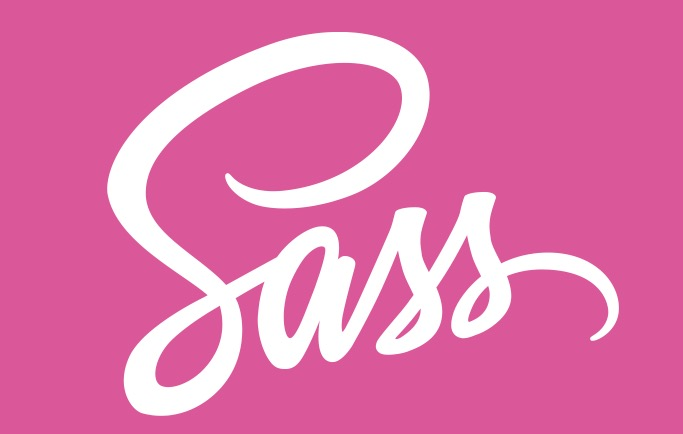

## scss 入门
最近看Element UI 的源码，然后发现Element UI 的样式是用scss 写的，所以就想着学学 scss
[中文官网](https://www.sass.hk)


### scss与sass的区别
  Scss 是 Sass 3 引入新的语法，其语法完全兼容 CSS3，并且继承了 Sass 的强大功能。简单来说scss 是sass 的一个升级版本。
  1. 语法形式上有些许不同，最主要的就是sass是靠缩进表示嵌套关系，scss是花括号
  ```js
      //sass 太费眼了
    .father
        width:100px;
        .son
            width:50px;
    //scss 适合我这种眼瘸手残患者
    .father{
        width:100px;
        .son{
            width:50px;
        }
    } 
  ```
  2.  文件扩展名不同

### scss 特点总结
1.  关于 @mixin @extend %placeholder 的试用场景

| 语法 | 功能 | 区别 |
|:---------- |:-------- |:---------- |
| @mixin |  - | — |
| @extend | - | — |
| %placeholder | - | — |

###
#### 1. @content
* `@content`用在`mixin`里面的，当定义一个`mixin`后，并且设置了`@content`; `@include`的时候可以传入相应的内容到`mixin`里面

 输入
 ```
 $color: white;
  @mixin colors($color: blue) {
    background-color: $color;
    @content;
    border-color: $color;
  }
  .colors {
    @include colors { color: $color; }
  }
 ```
  输出

  ```
 .colors {
  background-color: blue;
  color: white;
  border-color: blue;
}
 ```
