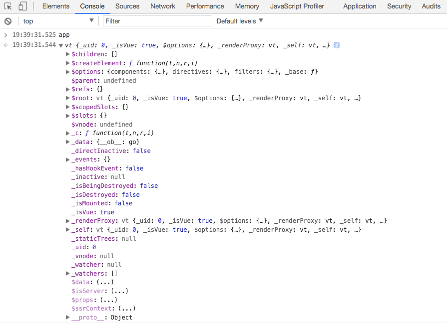
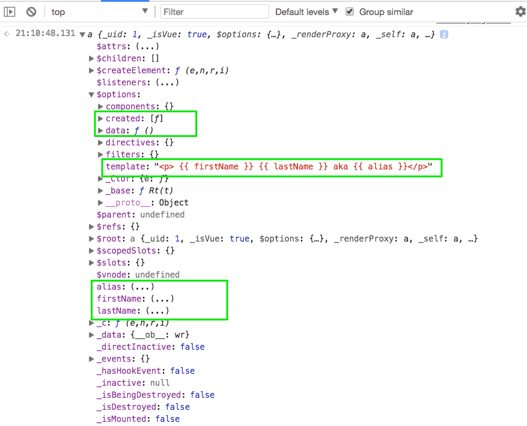
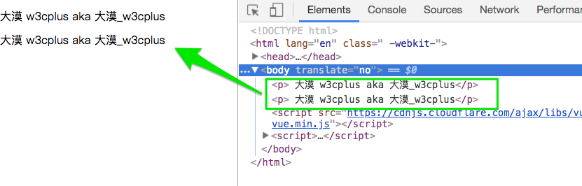
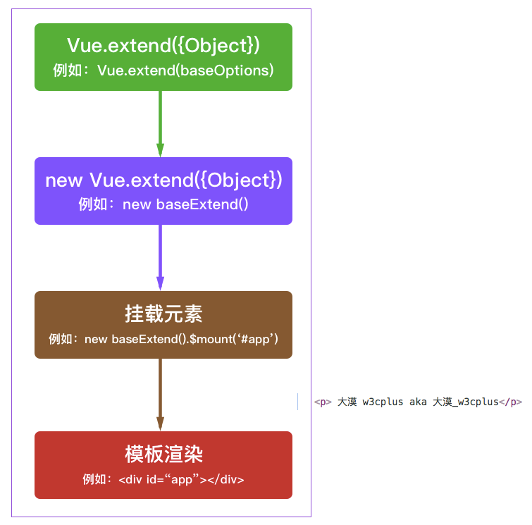

### 谈谈 vue.extend(options)
* 参数 `{ Object } options`


Vue.extend 返回的是一个`扩展实例构造器`,也就是预设了部分选项的Vue实例构造器。其主要用来服务于`Vue.component`,用来生成组件
`Vue.component`可以简单的理解为当在模板中遇到该组件名称作为标签的自定义元素时，会自动调用扩展实例构造器来生产组件实例，并挂载到自定义元素上
#### 创建一个Vue.extend
我们知道，在`Vue`实例创建之后，可以看到Vue实例预设了很多参数



那么创建一个Vue.extend其实也有点类似，首先通过`Vue.extend()`来创建一个扩展实例构造器

```js
let baseOptions = {
  template:`<p>{{firstName}}{{lastName}}aka{{alias}}</p>`,
  data(){
    return {
      firstName:'大漠',
      lastName:'w3cplus',
      alias:'大漠_w3cplus'
    }
  }
}
let baseExtend =  Vue.extend(baseOptions)
```
可以借用 `new`关键词来声明这个构造器

```js
new baseExtend()
```

可以看到，这个 `new Vue()`有点类似，除了我们预设的一些东西之外，Vue还给其预设了很多其他的东西





Vue的实例最终是要挂载到一个元素上，那`Vue.extend`也是一样的，也需要挂载到一个元素上

```js
new baseExtend().$mount('#app')
```
我尝试了一下像 Vue的实例挂载的方式

 ```js
 let app = new baseExtend({
   el:'#app'
 })
 ```
最终得到的效果是相同的，除此之外，还可以将其挂载到自定义的标签上，比如：

```html
<!-- HTML --> 
<custom-element></custom-element> 
<!-- Script --> 
new baseExtend().$mount('custom-element')
```

结果如下




整个过程是不是有点类似于Vue实例创建的过程



#### `Vue.extend的作用`

Vue.extend常和Vue的组件配合在一起使用。简单点说：Vue.extend是构造一个组件的语法，
你给这个构造器预设一些参数，而这个构造器给你一个组件，然而这个组件你就可以用到`Vue.component`这个全局注册方法里面，
也可以在任意`Vue`模版里面使用这个构造器


基于上面的实例，我们通过`Vue.extend`构建了一个baseExtend构造器，这个构造器具有`baseOptions`设置的参数

咱先忽略上面这段描述，来看`Vue.component()`创建的组件

```js
Vue.component('base-component',baseOptions)
let app = new Vue({
  el:'#app'
})
```
如果我们把`Vue.component()`中的 `baseOptions`换成前面已经创建的扩展器`baseExtend`:

```js
Vue.component('base-component',baseExtend)
// 其等价
Vue.component('base-component', Vue.extend(baseOptions))
```
也可以看到相同效果。即`Vue.component()会注册一个全局的组件，其会自动判断第二个传进来的是Vue继续对象（Vue.extend）还是普通对象({...})，如果传进来的是普能对象的话会自动调用Vue.extend，所以你先继承再传，还是直接传普通对象对Vue.component()的最终结果是没差的`

#### Vue.extend()和Vue.component()的区别

Vue允许你将注册的ViewModel构造函数视为可重用的组件，这些组件在概念上与`Web组件`相似，不需要任何`Pollify`。
要注册一个组件，首先使用 `Vue.extend()`创建一个Vue的子类构造函数，然后使用`Vue.component()`方法注册该构造函数

```js
// 扩展Vue来获取可重用的构造函数 
var MyComponent = Vue.extend({ template: '一个自定义的组件!' }) 
// 使用`id:my-component`注册构造函数 
Vue.component('my-component', MyComponent)
```

平时我们看到的是直接在Vue.component()中使用options对象，而不是实际的构造函数来注册一个组件

```js
Vue.component('my-component', { template: '一个自定义的组件!' })
```
其实上面这段代码隐式的调用了`Vue.extend()`,然后注册返回的构造函数。当你不需要编程实例化组件时候，使用此语法

然后你可以在父ViewModel的template中使用它

```js
<div v-component="my-component"></div>
```

当然，如果你喜欢，组件可以使用自定义元素标记的形式

```js
<my-component></my-component>
```
#### 总结

理解`Vue.extend()`和`Vue.component()`是很重要的。由于Vue本身是一个构造函数`(constructor)`，
`Vue.extend()`是一个继承于方法的类（class），参数是一个包含组件选项的对象。
它的目的是创建一个Vue的子类并且返回相应的构造函数。
而`Vue.component()`实际上是一个类似于`Vue.directive()`和`Vue.filter()`的注册方法，它的目的是给指定的一个构造函数与一个字符串ID关联起来。之后Vue可以把它用作模板，实际上当你直接传递选项给`Vue.component()`的时候，它会在背后调用`Vue.extend()`


