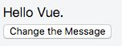
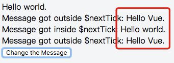

###  谈谈 Vue.nextTick

* Vue.nextTick([callback,context]) 
用途：在下次 DOM 更新循环结束之后执行延迟回调。在修改数据之后立即使用这个方法，获取更新后的 DOM。

#### 1. 示例

模版

```html
<div class="app">
  <div ref="msgDiv">{{msg}}</div>
  <div v-if="msg1">Message got outside $nextTick: {{msg1}}</div>
  <div v-if="msg2">Message got inside $nextTick: {{msg2}}</div>
  <div v-if="msg3">Message got outside $nextTick: {{msg3}}</div>
  <button @click="changeMsg">
    Change the Message
  </button>
</div>
```

```js
new Vue({
  el: '.app',
  data: {
    msg: 'Hello Vue.',
    msg1: '',
    msg2: '',
    msg3: ''
  },
  methods: {
    changeMsg() {
      this.msg = "Hello world."
      this.msg1 = this.$refs.msgDiv.innerHTML
      this.$nextTick(() => {
        this.msg2 = this.$refs.msgDiv.innerHTML
      })
      this.msg3 = this.$refs.msgDiv.innerHTML
    }
  }
})
```

点击前



点击后



从图中可以得知：msg1和msg3显示的内容还是变换之前的，而msg2显示的内容是变换之后的。其根本原因是因为Vue中DOM更新是异步的

#### 2. 应用场景
下面了解下`nextTick`的主要应用的场景及原因

* 在 `Vue`生命周期的create()钩子函数进行的DOM操作一定要放在`Vue.next()`的回调函数中

在`created()`钩子函数执行的时候`DOM`其实并没有进行渲染，详情可以看`生命周期`那篇文章，而此时进行DOM操作是无效的，
所以在此处要将DOM操作的js代码放进 `Vue.nextTick()`的回调函数中。与之对应的就是`mounted`钩子函数，因为该钩子函数执行时
所有的`DOM`挂载和渲染已经完成，此时在该钩子函数中进行任何`DOM`操作都不会有问题

* 在数据变化后要进行的某个操作，而这个操作需要使用随数据改变而改变的`DOM`结构的时候，这个操作都应该放进`Vue.nextTick()`的回调函数中


具体原因在`Vue`的官方有解释

>`Vue` 异步执行 DOM 更新。只要观察到数据变化，Vue 将开启一个队列，并缓冲在同一事件循环中发生的所有数据改变。
如果同一个 watcher 被多次触发，只会被推入到队列中一次。这种在缓冲时去除重复数据对于避免不必要的计算和 DOM 操作上非常重要。
然后，在下一个的事件循环“tick”中，Vue 刷新队列并执行实际 (已去重的) 工作。Vue 在内部尝试对异步队列使用原生的 `Promise.then` 和 `MessageChannel`，如果执行环境不支持，会采用 `setTimeout(fn, 0)`代替。

> 例如，当你设置vm.someData = 'new value'，该组件不会立即重新渲染。当刷新队列时，组件会在事件循环队列清空时的下一个“tick”更新。多数情况我们不需要关心这个过程，但是如果你想在 DOM 状态更新后做点什么，这就可能会有些棘手。虽然 `Vue.js` 通常鼓励开发人员沿着“数据驱动”的方式思考，避免直接接触 `DOM`，但是有时我们确实要这么做。为了在数据变化之后等待 `Vue` 完成更新 `DOM` ，可以在数据变化之后立即使用`Vue.nextTick(callback)` 。这样回调函数在 `DOM` 更新完成后就会调用。


