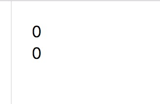
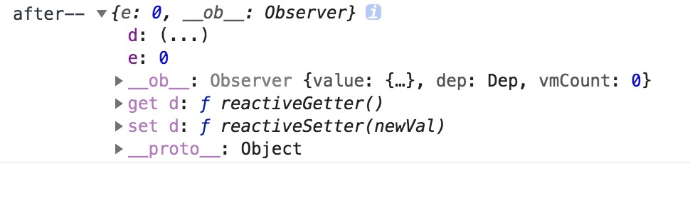
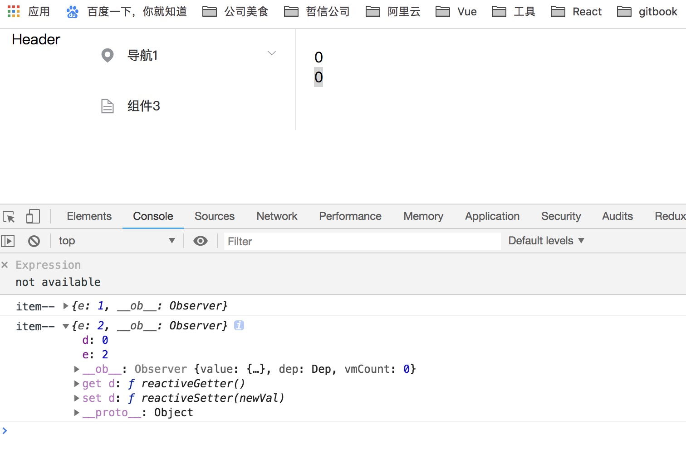

### Vue给对象新增属性（使用Vue.$set()）

在开发过程中，我们时常会遇到这样一种情况，当Vue的data 里边声明或者已经赋值过的对象
或者数组(数组里面的值是对象)时候，向对象中添加新的属性，如果更新此属性的值，是不会更新视图的

>根据官方文档定义:`如果在实例创建之后添加新的属性到实例上，它不会触发视图更新`

受现代JS的限制(以及废弃Object.observe),由于`Vue`会在初始化实例时候对属性执行`getter/setter`转化过程，
所以属性必须在data对象上存在才能让Vue转换它，这样它才是响应的

看以下实例

```html
<template>
  <div class="test-container">
    <div @click='addd(obj)'>{{obj.d}}</div>
    <div @click='adde(obj)'>{{obj.e}}</div>
  </div>
</template>
<script>
export default {
  name: 'TestOne',
  data() {
    return {
      obj:{}
    }
  },
  mounted(){
    this.obj = { d:0 }
    this.obj.e = 0
    console.log('after--',this.obj)
  },
  methods:{
    addd(item) {
      item.d = item.d + 1
      console.log('item--',item)
    },
    adde(item) {
      item.e = item.e + 1
      console.log('item--',item)
    }
  }
}
</script>
```



可以看出d属性是有 `get`和`set`方法的，而新增的`e`属性是没有的。


点击触发2此`adde`, 页面效果以及控制台输出如下



我们发现，更新属性`e`, 是不会更新视图，但是会改变其值

店家触发1次`addd`,页面效果以及控制台输出如下


我们发现，更新属性`d`, 更新视图，同时将新增的属性`e`的值也更新到视图里面


#### 解决方案，我们的 $set  可以登场了

* Vue 不允许在已经创建的实例上动态添加新的根级响应式属性 (root-level reactive property)。
然而它可以使用 `Vue.set(object, key, value)` 方法将响应属性添加到嵌套的对象上


* 有时你想向已有对象上添加一些属性，例如使用 `Object.assign()` 或 `_.extend()` 方法来添加属性。
但是，添加到对象上的新属性不会触发更新。在这种情况下可以创建一个新的对象，让它包含原对象的属性和新的属性

```js

// 代替 Object.assign(this.obj, { a: 1, e: 2 })
this.obj= Object.assign({}, this.obj, { a: 1, e: 2 })

```

* 如果想向数组中更新一些内容，可以这样

```js

data:{
  arr1 = ['a','b','c']
}
vm.$set(arr1,2,'d')

```

#### 顺便说说 vue.delete(target,key) 吧
* 参数
  1. `{Object| Array} target`
  2. `{string|number} key/index`

* 用法 
  > 删除对象的属性。如果对象是响应式的，确保删除能触发更新视图。
  这个方法主要用于避开 Vue 不能检测到属性被删除的限制，
  但是你应该很少会使用它。


