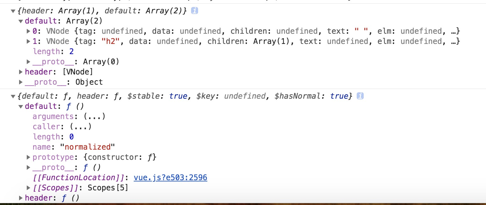

### $slots 跟 $scoped-slots 的对比

* 关于插槽的文章可以看[Vue的插槽](../vue/slot.md)
* 这里我们主要讨论自组件属性中 $slots和 $scoped-slots的区别

父组件
```html
<template>
  <div>
    <testChild>
      <template slot='header'>
        <h2>  I  Am HEADER</h2>
      </template>
      <template >
        <h2>  I  Am default</h2>
      </template>
      <template slot-scope="slotProps">
        <span>{{slotProps.data.text}}</span>
      </template>
    </testChild>
  </div>
</template>
<script>
import testChild from './testChild.vue'
export default {
  name: 'testView',
  components:{
    testChild
  }
}
</script>
```
子组件

```html
<template>
  <div>
    <template v-if='$slots.header'>
      <slot name='header'></slot>
    </template>
    <!-- <template v-if='$slots.default'>
      <slot></slot>
    </template> -->
    <slot :data='data'></slot>
  </div>
</template>
<script>
export default {
  name:'testChild',
  mounted(){
    console.log(this.$slots) 
    console.log(this.$scopedSlots)
  },
  data(){
    return {
      data:{
        text:'I Am slotProps'
      }
    }
  }
}
</script>
```


从上图打印出来看 

* `$slots` 中包括具名插槽和 default 插槽, 而  default 中包含了 作用域插槽 和 `default` 插槽

* `$scopedSlots` 有具名插槽和作用域插槽  

* 注意，一个组件中显示只能有一个默认插槽活着一个 作用域插槽，不然`Vue`渲染会出错

