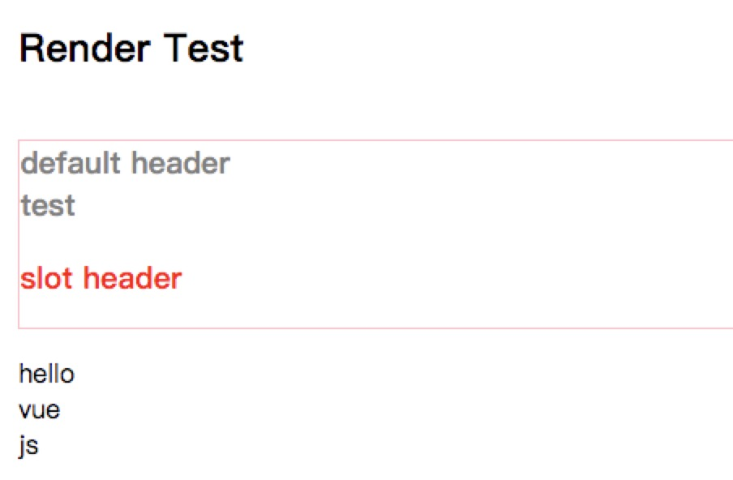

### render

* 类型： `(createElement: () => VNode) => VNode`
* 详细： 

字符串模板的代替方案，允许你发挥 JavaScript 最大的编程能力。该渲染函数接收一个 createElement 方法作为第一个参数用来创建 VNode。

```js
import Vue from 'vue'
import App from './App'
new Vue({
  el: '#app',
  render: h => h(App)
})
// h 是一个 createElement方法
```
> Vue 选项中的 render 函数若存在，则 Vue 构造函数不会从 template 选项或通过 el 选项指定的挂载元素中提取出的 HTML 模板编译渲染函数

```js
Vue.component('anchored-heading', {
  render: function (createElement) {
    return createElement(
      'h' + this.level,   // 标签名称
      this.$slots.default // 子元素数组
    )
  },
  props: {
    level: {
      type: Number,
      required: true
    }
  }
})
```

#### 例子
* `index.vue`
```html
<template>
  <div id="app">
    <RenderTest msg="Render Test" :level="3" :items="items">
      <div class="header">default header</div>
      <p slot="header">slot header</p>
    </RenderTest>
  </div>
</template>
<script>
import RenderTest from './renderTest.vue'
export default {
  name: 'TestOne',
  components: {
    RenderTest
  },
  data() {
    return {
      items: [
        {
          name: 'hello'
        },
        {
          name: 'vue'
        },
        {
          name: 'js'
        }
      ]
    }
  }
}
</script>
```
* `renderTest.vue`


```html
<template>
  <div class="render">
    <h1>{{ msg }}</h1>
    <renderComponent></renderComponent>
    <renderComponentList></renderComponentList>
  </div>
</template>

<script>
export default {
  name: 'RenderTest',
  props: {
    msg: String,
    level: {
      type: Number,
      required: true
    },
    items: {
      type: Array,
      required: false
    }
  },
  components: {
    renderComponent: {
      /**
       * render: 渲染函数
       * 参数: createElement
       * 参数类型: Function
       */
      render: function (createElement) {
        console.log(this)
        let _this = this['$options'].parent
        console.log(_this)
        console.log(_this.$slots)
        let _header = _this.$slots.header
        /**
         * createElement 本身也是一个函数，它有三个参数
         * 
         * 返回值: VNode
         * 
         * 1. 一个 HTML 标签字符串，组件选项对象，或者解析上述任何一种的一个 async 异步函数。必需参数。{String | Object | Function} - 就是你要渲染的最外层标签
         * 
         * 2. 一个包含模板相关属性的数据对象你可以在 template 中使用这些特性。可选参数。{Object} - 1中的标签的属性
         * 
         * 3. 子虚拟节点 (VNodes)，由 `createElement()` 构建而成，也可以使用字符串来生成“文本虚拟节点”。可选参数。{String | Array} - 1的子节点，可以用 createElement() 创建，文本节点直接写就可以
         */

        return createElement(                 
          'h' + _this.level,   // 标签名称 - 第一个参数
          {
            style: {
              color: 'gray',
              border: '1px solid pink'
            }
          },   // 第二个单数
          [
            _this.$slots.default, 
            'test',
            createElement(
              'div',
              {
                'class': {
                  'slotsWrap': true
                }
              },
              [createElement(
                'div',
                {
                  style:{
                    color:'red'
                  }
                }, _header)]
            )
          ] // 子元素数组 - 第三个参数
        )
      }
    },
    renderComponentList: {
      render: function (createElement) {
        let _this = this['$options'].parent

        if (_this.items.length) {
          return createElement(
            'ul', 
            _this.items.map(function (item) {
              return createElement('li', item.name)
            })
          )
        } 
        else {
          return createElement('p', 'No items found.')
        }
      }
    }
  }
}
</script>

<!-- Add "scoped" attribute to limit CSS to this component only -->
<style scoped>
h3 {
  margin: 40px 0 0;
}
ul {
  list-style-type: none;
  padding: 0;
}
li {
  display: inline-block;
  margin: 0 10px;
}
a {
  color: #42b983;
}
</style>
```


