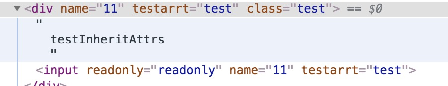

### 谈谈 vue 中的配置项 inheritAttrs

* 类型：`bollean`
* 默认值：`true`
* 详细

  >默认情况下父作用域下不被认作`props`的特性绑定(`attribute bindings`) 将会 `回退` 
  且作为普通的`HTML`特性应用在子组件的根元素上。当撰写包裹一个目标元素或另外一个组件的时候，
  这可能不会总是符合预期行为。通过设置 `inheritAttrs` 倒 `false`,这些默认行为将会被去掉。
  而通过实例属性`$attrs`可以让这些特性生效，且可以通过`v-bind`显性的绑定到非根元素上

  注意：这个选项**不影响** `class` 和 `style` 绑定

### example

子组件:inheritAttrs:true
```html
<template>
  <div>
    testInheritAttrs
    <input 
      :readonly='readonly'
      v-bind='$attrs'
    />
  </div>
</template>
<script>
export default {
  name:'testInheritAttrs',
  props:{
    readonly: Boolean,
  },
  inheritAttrs:true, // 默认情况
  mounted(){
    console.log(this.$attrs)
  }
}
</script>
```
父组件

```html
<template>
  <div class="test-container">
    <test-inherit-attrs :readonly="readonly" class='test' name='11' testArrt='test'/>
  </div>
</template>
<script>
import testInheritAttrs from './testInheritAttrs.vue'
export default {
  name: 'TestTwo',
  components:{
    testInheritAttrs
  },
  data() {
    return {
      readonly:true,
    }
  }
}
</script>
```

让我们来看下html 中渲染出来的样子



