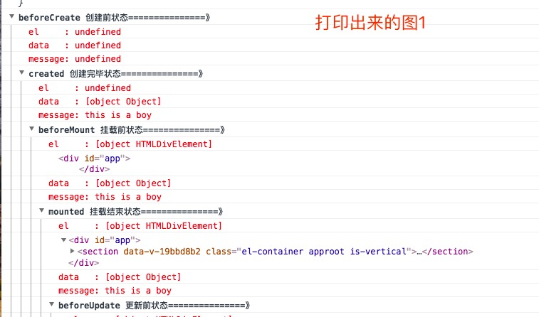
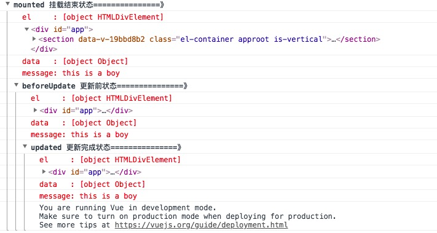
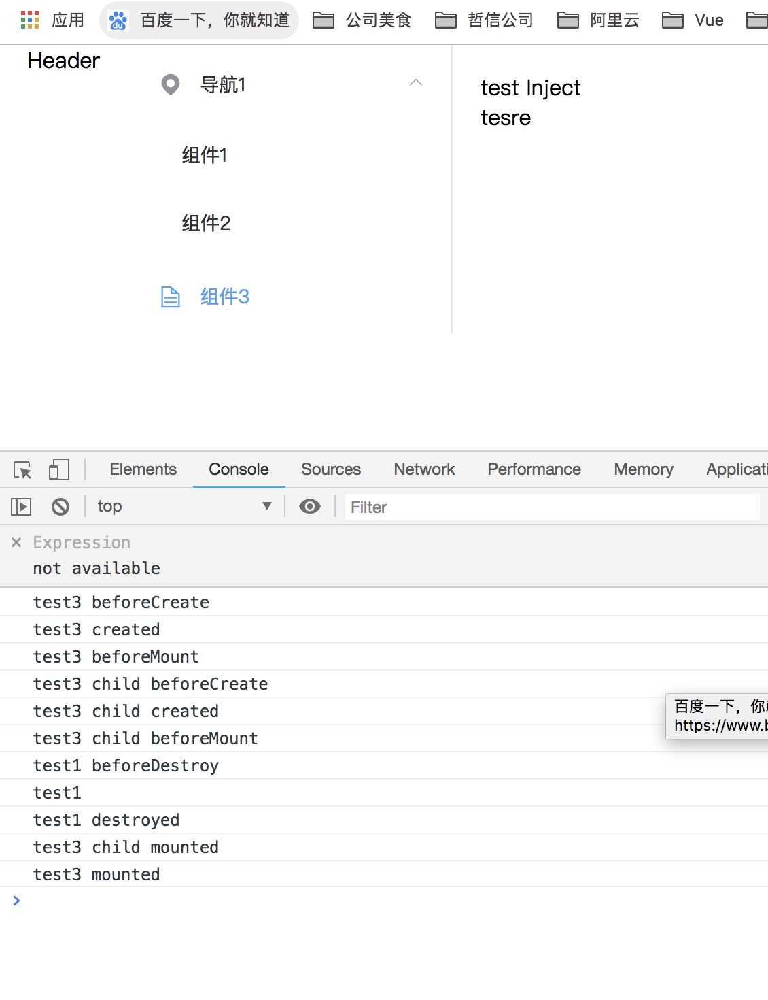
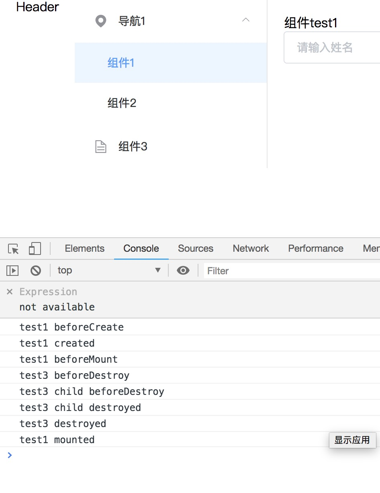

### 浅浅的谈一谈关于Vue 的生命周期
#### lifecycle hooks  

| vue 2.0 | description |
| ------ | ------ |
| beforeCreate | 组件实例刚被创建，组件属性计算之前，如data属性等 |
| created | 组件实例创建完成，属性已被绑定，但DOM还未生成，$el属性还不存在 |
| beforeMount| 模版编译/挂载之前 |
| mounted | 模版编译/挂载之后 |
| beforeUpdate| 组件更新之前 |
| updated | 组件更新之后 |
| activated| for keep-alive,组件被激活时调用 |
| deactivated | for keep-alive,组件被激活时调用 |
| beforeDestory| 组件销毁前用 |
| destoryed | 组件销毁后用 | 

#### 生命周期研究

1. demo 

```js
new Vue({
  data: {
    message: 'this is a boy'
  },
  el: '#app',
  router,
  store,
  template: '<App/>',
  components: {App},
  beforeCreate: function () {
    console.group('beforeCreate 创建前状态===============》')
    console.log('%c%s', 'color:red', 'el     : ' + this.$el) // undefined Vue 实例使用的根 DOM 元素
    console.log('%c%s', 'color:red', 'data   : ' + this.$data) // undefined
    console.log('%c%s', 'color:red', 'message: ' + this.message)
  },
  created: function () {
    console.group('created 创建完毕状态===============》')
    console.log('%c%s', 'color:red', 'el     : ' + this.$el) // undefined
    console.log('%c%s', 'color:red', 'data   : ' + this.$data) // 已被初始化
    console.log('%c%s', 'color:red', 'message: ' + this.message) // 已被初始化
  },
  beforeMount: function () {
    console.group('beforeMount 挂载前状态===============》')
    console.log('%c%s', 'color:red', 'el     : ' + (this.$el)) // 已被初始化
    console.log(this.$el)
    console.log('%c%s', 'color:red', 'data   : ' + this.$data) // 已被初始化
    console.log('%c%s', 'color:red', 'message: ' + this.message) // 已被初始化
  },
  mounted: function () {
    console.group('mounted 挂载结束状态===============》')
    console.log('%c%s', 'color:red', 'el     : ' + this.$el) // 已被初始化
    console.log(this.$el)
    console.log('%c%s', 'color:red', 'data   : ' + this.$data) // 已被初始化
    console.log('%c%s', 'color:red', 'message: ' + this.message) // 已被初始化
  },
  beforeUpdate: function () {
    console.group('beforeUpdate 更新前状态===============》')
    console.log('%c%s', 'color:red', 'el     : ' + this.$el)
    console.log(this.$el)
    console.log('%c%s', 'color:red', 'data   : ' + this.$data)
    console.log('%c%s', 'color:red', 'message: ' + this.message)
  },
  updated: function () {
    console.group('updated 更新完成状态===============》')
    console.log('%c%s', 'color:red', 'el     : ' + this.$el)
    console.log(this.$el)
    console.log('%c%s', 'color:red', 'data   : ' + this.$data)
    console.log('%c%s', 'color:red', 'message: ' + this.message)
  },
  beforeDestroy: function () {
    console.group('beforeDestroy 销毁前状态===============》')
    console.log('%c%s', 'color:red', 'el     : ' + this.$el)
    console.log(this.$el)
    console.log('%c%s', 'color:red', 'data   : ' + this.$data)
    console.log('%c%s', 'color:red', 'message: ' + this.message)
  },
  destroyed: function () {
    console.group('destroyed 销毁完成状态===============》')
    console.log('%c%s', 'color:red', 'el     : ' + this.$el)
    console.log(this.$el)
    console.log('%c%s', 'color:red', 'data   : ' + this.$data)
    console.log('%c%s', 'color:red', 'message: ' + this.message)
  }
})

```
   打印出来的结果如下
   
   

   *  beforeCreate 情况下： `$el` `data`  `message`  都还没有
   *  created 情况下 ：`$el` 未生成， 模版开始进行编译
   *  beforeMount 情况下：`$el` 生成 ，注意html还未挂载，
   *  mounted 情况下： html已经挂载，此时可以做一些ajax的操作
   * beforeDestroy： 销毁前的状态
   * destroyed : vue 实例销毁

   下面放一张 官网出的图
    

####  生命周期总结
1. beforecreate : 举个栗子：可以在这加个loading事件 
2. created ：在这结束loading，还做一些初始化，实现函数自执行 
3. mounted ： 在这发起后端请求，拿回数据，配合路由钩子做一些事情
4. beforeDestroy： 你确认删除XX吗？
5. destroyed ：当前组件已被删除，清空相关内容


#### 还有一个小问题，父组件跟子组件之间的生命周期是什么关系呢？？

从组件`test1` 点到 `test3`直接把我的测试结果贴上来把



* 总结，从图上来看，从组件1点击到组件3的时候 先走 `test3 父组件`的  `beforeCreate`  `created` `beforeMount`
* 然后再走 `test3子组件中`的 `beforeCreate`  `created` `beforeMount`
* 其次再走 `test1`组件中的 `beforeDestroy` `destroyed`
* 再走 `test3子组件`的  `mounted`
* 再走  `test3父组件`的 `mounted`

然后再从组件`test3`再切回  `test1` 会发生什么呢



* 总结，从图上来看，从`test3`再切回  `test1` 的时候，先走了 `test1`的 `beforeCreate`  `created` `beforeMount`
* 然后再走 `test3父组件`的 `beforeDestroy`
* 再走 `test3子组件中`的 `beforeDestroy`  `destroyed`
* 然后走 `test3父组件`的 `destroyed`
* 最后走 `test1` 的 `mounted`