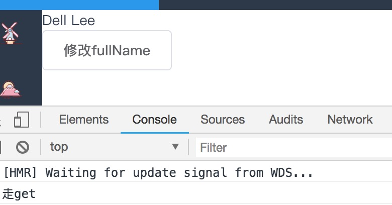
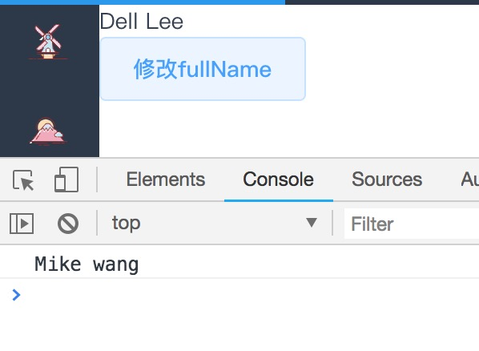
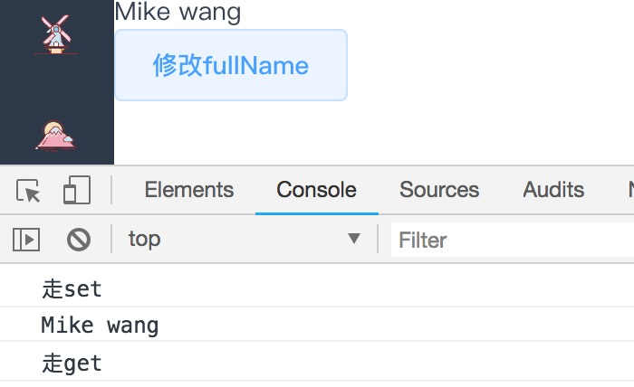

### 谈谈 Vue  中 的 computed
computed 是 Vue 中的计算属性功能。看下面的一个简单例子
```html 
<template>
  <div>
    <div>
      {{fullName}}
    </div>
    <div>
      <el-button @click='changeFullName'>修改fullName</el-button>
    </div>
  </div>
</template>
<script>
  export default {
    name: 'test',
    data () {
      return {
        firstName: 'Dell',
        lastName: 'Lee'
      }
    },
    computed: {
      fullName: {
        get: function () {
          return this.firstName + ' ' + this.lastName
        },
        set: function (value) {
          console.log(value)
        }
      }
    },
    methods: {
      changeFullName () {
        this.fullName = 'Mike wang'
      }
    }
  }
</script>
  
```
*  初始情况下，页面输出如下


我们可以看到`fullName` 的值 依赖于 `firstName` 和 `lastName`

* 当我们点击 按钮的时候，`fullName`中的`set`方法运行，页面输出如下



* 来修改 set 函数
```js
computed: {
  fullName: {
    // getter
    get: function () {
      console.log('走set')
      return this.firstName + ' ' + this.lastName
    },
    // setter
    set: function (value) {
      console.log('走get')
      this.fistName=value.split(' ')[0]
      this.lastName=value.split(' ')[1]
      console.log(value)
    }
  }
}
```
输出如下


 
我们可以看到先走了 `set`方法，因为`set`方法修改了firstName和lastName，由于fullName 当依赖的值发生变化则会重新计算,即重新执行了`get`方法

* 计算属性默认只有 `get`方法，写法如下
```js
computed: {
  fullName(){
    return this.firstName + ' ' + this.lastName
  }
}
```

### 我对于computed 的理解
  * data 属性初始化 `get` `set`
  * computed 计算属性初始化，提供的函数将用作属性 `fullName` 的 `get`和`set`
  * 当首次获取 `fullName` 计算属性的值时，vue 开始`fullName`依赖收集
  * 当初始情况下执行`fullName`的 `get`方法时候，Vue判定 `firstName `和 `lastName` 是`fullName`的依赖
  * 在执行`changeFullName`方法时，执行了`set`方法，由于`set`方法中修改了`firstName `和 `lastName`，故Vue又执行了`get`方法，修改了`fullName`的值
  * 通过上面的例子我们也可以看到计算属性是基于它们的依赖进行缓存的，计算属性只有在它的相关依赖发生改变时才会重新求值。

