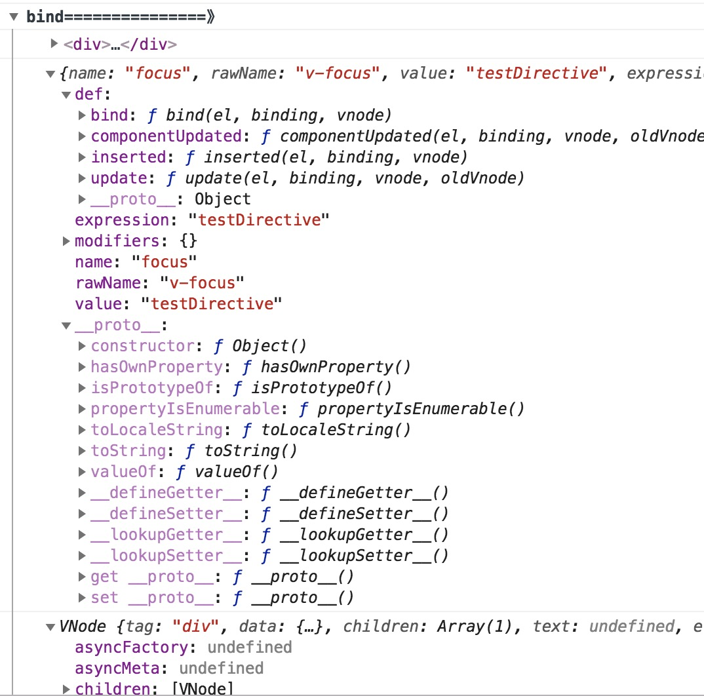
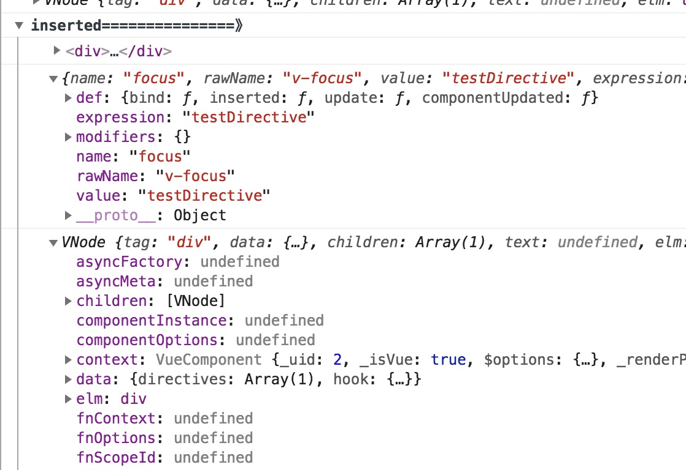
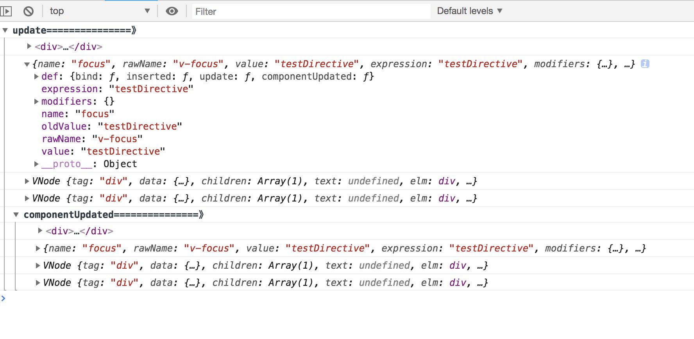

vue 入门中，本文收集一些Vue 2.0版本与1.0版本的不同之处，欢迎大家补充。

下面是目前收集的信息。

### 自定义指令
 在 Vue 2.0中，除了核心功能默认内置的指令( `v-model` 和 `v-show` )之外，我们还可以允许注册自定义指令
 注意：在Vue2.0中，代码复用和抽象的主要形式是组件。然而，有的情况下，你仍然需要对普通DOM元素进行底层操作。
 这个时候会用到`自定义指令`

#### 1. 钩子函数
  一个指令定义对象可以提供如下几个钩子函数

* `bind`: 只调用一次，指令第一次绑定到元素时调用。在这里可以进行一次性的初始化设置
* `inserted`: 被绑定元素插入父节点时候调用(仅保证父节点存在，但不一定已被插入文档)
* `update`: 所在组件的VNode 更新时候调用，但是可能发生在其子 VNode 更新之前。指令的值可能发生了改变，也可能没有。但是你可以通过比较更新前后的值来忽略不必要的模板更新
* `componentUpdated`: 指令所在组件的 VNode 及其子 VNode 全部更新后调用。
*  `unbind`: 只调用一次，指令与元素解绑时调用。
  
#### 2. 钩子函数参数 (`el`, `binding`,`vnode` 和`oldVnode`)

指令钩子函数会被传入以下参数

* `el`:指令所绑定的元素，可以用来直接操作`DOM`
* `binding`:一个对象，包含以下属性
  1. `name`: 指令名，不包括 `v-` 前缀 。
  2. `value`: 指令的绑定值，例如：`v-my-directive="1 + 1"` 中，绑定值为 `2` 。
  3. `oldValue`：指令绑定的前一个值，仅在 `update` 和 `componentUpdated` 钩子中可用。无论值是否改变都可用。
  4. `expression`: 字符串形式的指令表达式。例如 `v-my-directive="1 + 1"` 中，表达式为 `"1 + 1"`。
  5. `arg`:传给指令的参数，可选。例如 `v-my-directive:foo` 中，参数为 `"foo"`
  6. `modifiers`: 一个包含修饰符的对象。例如：`v-my-directive.foo.bar` 中，修饰符对象为 `{ foo: true, bar: true }`。

* vnode: Vue编译生成的虚拟节点
* oldVnode: 上一个虚拟节点，仅在 `update` 和 `componentUpdated` 钩子中可用。

#### 3.  实例
 在 focus.js 中写一个 自定义指令
 ``` js
 export default {
  bind(el,binding,vnode) {  // 只调用一次，指令第一次绑定到元素时调用。在这里可以进行一次性的初始化设置。
    console.group('bind===============》')
    console.log(el)
    console.log(binding)
    console.log(vnode)
  },
  inserted(el,binding,vnode) { // 被绑定元素插入父节点时调用 (仅保证父节点存在，但不一定已被插入文档中)。
    console.group('inserted===============》')
    console.log(el)
    console.log(binding)
    console.log(vnode)
  },
  update(el,binding,vnode,oldVnode) {    
    console.group('update===============》')
    console.log(el)
    console.log(binding)
    console.log(vnode)
    console.log(oldVnode)
  },
  componentUpdated(el,binding,vnode,oldVnode) {  // 指令所在组件的 VNode 及其子 VNode 全部更新后调用。
    console.group('componentUpdated===============》')
    console.log(el)
    console.log(binding)
    console.log(vnode)
    console.log(oldVnode)
  }
}
 ```
 在 index.js 中
 ```js
 import focus from './focus'
  export default {
    focus
  }

 ```

然后在项目入口文件中把指令注册上去
``` js
import directive from '@/directive/index'
// 注册指令 
Object.keys(directive).forEach((key) => {
  Vue.directive(key,directive[key])
})
```

  应用：父组件

  ```js
    <template>
      <div>
        <div>
          {{message}}
        </div>
        <div>
          <el-button @click ='change'>更新父组件message</el-button>
        </div>
        <div v-focus = 'testDirective'>
          <directive-child/>
        </div>
      </div>
    </template>
    <script>
    import directiveChild from './components/directiveChild.vue'
    export default {
      name:'DirectiveParent',
      components:{
        directiveChild
      },
      data(){
        return {
          message:'这是父组件',
          testDirective:'testDirective'
        }
      },
      methods:{
        change(){
          this.message = '父组件已更新'
        }
      }
    }
  </script>

  ```
  子组件

  ```js
  <template>
    <div>
      <div >
        {{message}}
      </div>
      <div >
        <el-button @click = 'change'>更新子组件message</el-button>
      </div>
    </div>
  </template>
  <script>
  export default {
    name:'DirectiveChild',
    data(){
      return  {
        message:'这是子组件'
      }
    },
    methods:{
      change(){
        this.message = '子组件已更新'
      }
    }
  }
  </script>
  ```

  * 组件初始化的时候 钩子函数 `bind` 和 `inserted` 函数被调用了 ，打印的结果如下
  
  

  * 父组件点击 按钮 `更新父组件message` 钩子函数 `update` 和 `componentUpdated`  被调用了，打印的结果如下
  

  * 注意当点击子组件按钮 `更新子组件message`,`v-focus`指令 的钩子函数没有被调用，说明指令的钩子函数的调用只限于被指令被调用的组件中才能执行

  * 指令对象字面量

  如果指令需要多个值，可以传入一个 JavaScript 对象字面量。记住，指令函数能够接受所有合法的 JavaScript 表达式。
    ```html
    <div v-demo="{ color: 'white', text: 'hello!' }"></div>
    ```

    ```js
    Vue.directive('demo', function (el, binding) {
      console.log(binding.value.color) // => "white"
      console.log(binding.value.text)  // => "hello!"
    })
    ```


