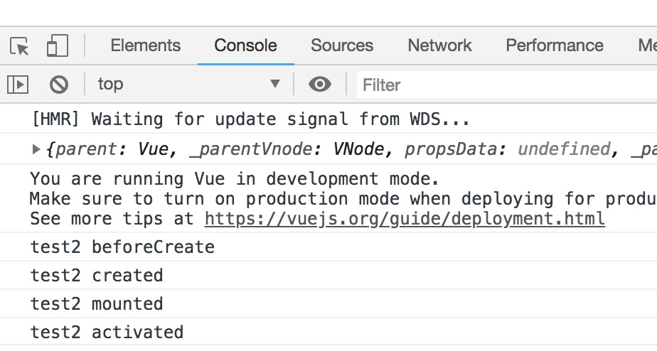
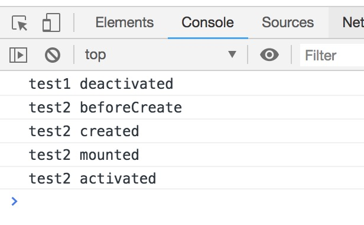
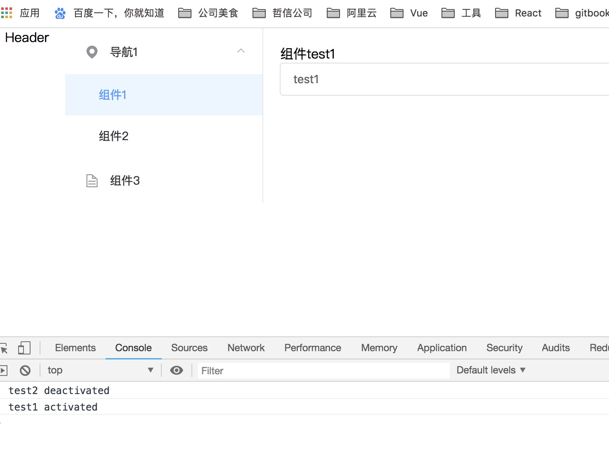

### Vue的keep-alive用法

`keep-alive` 是Vue提供的一个抽象组件，用来对组件进行缓存，从而节省性能。由于是一个抽象组件，所以在页面渲染完毕后不会被渲染成一个DOM元素


在做电商有关的项目中，当我们第一次进入列表页需要请求一下数据，当我从列表页进入详情页，详情页不缓存也需要请求下数据，然后返回列表页，这时候我们使用keep-alive来缓存组件，防止二次渲染，这样会大大的节省性能。

* keep-alive 的基本用法
```js
 // appMain.vue
 <template>
  <el-main>
    <transition name="fade-transform" mode="out-in">
      <keep-alive>
        <router-view />
      </keep-alive>
    </transition>
  </el-main>
</template>
<script>
export default {
  name: 'AppMain'
}
</script>
```

页面界面我么来看下



先进入组件test1

```js 
<template>
  <div class="test-container">
    <div>组件test1</div>
    <el-input v-model="name" placeholder="请输入姓名" />
  </div>
</template>
<script>
export default {
  name: 'TestOne',
  data() {
    return {
      name: ''
    }
  },
  beforeCreate() {
    console.log('test1 beforeCreate')
  },
  created() {
    console.log('test1 created')
  },
  mounted() {
    console.log('test1 mounted')
  },
  activated() {
    console.log('test1 activated')
  },
  deactivated() {
    console.log('test1 deactivated')
  },
  beforeDestroy() {
    console.log('test1 beforeDestroy')
  },
  destroyed() {
    console.log('test1 destroyed')
  }
}
</script>
```

输出如下


我们可以看到`组件1` 的钩子函数 按照 `beforeCreate` `created` `mounted` `activated` 这个顺序被调用了
然后我们进入`组件2` ,

```js
<template>
  <div class="test-container">
    <div>组件test2</div>
    <el-input v-model="name" placeholder="请输入姓名" />
  </div>
</template>
<script>
export default {
  name: 'TestTwo',
  data() {
    return {
      name: ''
    }
  },
  beforeCreate() {
    console.log('test2 beforeCreate')
  },
  created() {
    console.log('test2 created')
  },
  mounted() {
    console.log('test2 mounted')
  },
  activated() {
    console.log('test2 activated')
  },
  deactivated() {
    console.log('test2 deactivated')
  }
}
</script>
```
输出如下


我们可以看到`组件1` 的钩子函数 `deactived`被调用了，`组件2`的钩子函数`beforeCreate` `created` `mounted` `actived`

然后我们在切到 `组件1`

输出如下

我们可以看到`组件2`的钩子函数`deactivated` 被调用了，`组件2`的钩子函数 `activated` 被调用了，然而其他生命周期函数没有被调用。
并且`组件1`的表单中还保留着之前的输入，这就是 `keep-alive`的作用。在业务开发中，如果有路由跳转但是返回需要保留数据的场景


* 利用include、exclude 属性

```html
<keep-alive include="bookLists,bookLists">
  <router-view></router-view>
</keep-alive>
<keep-alive exclude="indexLists">
  <router-view></router-view>
</keep-alive>
```
include属性表示只有name属性为bookLists，bookLists的组件会被缓存，（注意是组件的名字，不是路由的名字）其它组件不会被缓存exclude属性表示除了name属性为indexLists的组件不会被缓存，其它组件都会被缓存

* 利用meta属性
```js
export default[
 {
  path:'/',
  name:'home',
  components:Home,
  meta:{
    keepAlive:true //需要被缓存的组件
 },
 {
  path:'/book',
  name:'book',
  components:Book,
  meta:{
    keepAlive:false //不需要被缓存的组件
  }
 }
]
```


```js
<keep-alive>
  <router-view v-if="this.$route.meta.keepAlive"></router-view>  // 里是会被缓存的组件
</keep-alive>
<keep-alive v-if="!this.$router.meta.keepAlive"></keep-alive> // 这里是不会被缓存的组件

```

* 包裹在keep-alive中的组件的状态会被保留，其中我们将某个列表类组件内容滑动到第100条位置，
那么我们在切换都另外一个组件后再切换回该组件，该组件的位置状态依旧会保持在第100条列表处


