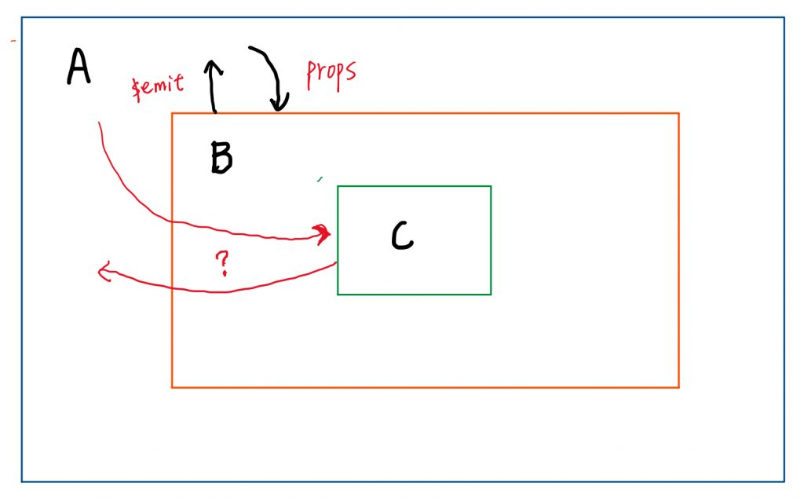

### `$attrs`和`$listeners`的使用

\# **现在我们讨论下 A组件和 B 组件 如何通信，有几种解决方案**

1. **Vuex:**
  我Vuex来进行数据管理，但是如果项目中**多个组件共享状态比较少**，项目比较小，并且全局状态比较少，那使用`Vuex`来实现该功能，并没有发挥出`Vuex`威力

2. **通过B组件**
  使用B来做中转站，当**A组件**需要把信息传给**C组件**时候，B接受**A组件**的信息，然后利用属性传给**C组件**
