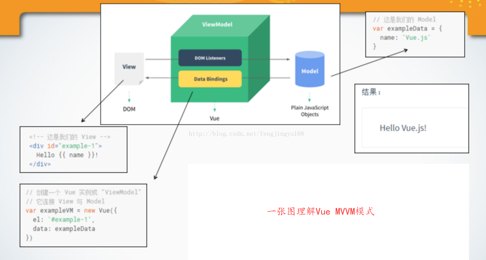

### 对于Vue这种MVVM设计模式的理解

####  :rose: MVVM 模式有四个组成部分

* **模型**：是指代表真实状态内容的领域模型（面向对象），或指代表内容的数据访问层（以数据为中心）。

* **视图：**就像在MVC模式中一样，视图是用户在屏幕上看到的结构、布局和外观（UI）。

* **视图模型：** 是暴露公共属性和命令的视图的抽象，MVVM没有MVC模式的控制器，有的是一个绑定器。在视图模型中，绑定器在视图和数据绑定器之间进行通信。

* **绑定器：** 在`Vue`中体现在vue 提供了很多数据绑定的方法：属性绑定，文本插值等等

#### vue框架正是 MVVM 这种设计模式的一种实现

Vue.js是当下很火的一个JavaScript MVVM库，它是以数据驱动和组件化的思想构建的。我们可以用一张图来解释 vue 中 的 MVVM 模式

ViewModel是Vue.js的核心，它是一个Vue实例。Vue实例是作用于某一个HTML元素上的，这个元素可以是HTML的body元素，也可以是指定了id的某个元素。

从上图我们可以看出  `DOM Listeners`和 `Data Bindings` 是实现双向绑定的关键

从View侧看，ViewModel中的`DOM Listeners`工具会帮我们监测页面上DOM元素的变化，如果有变化，则更改Model中的数据(**指令 `v-model`的作用**)

从Model侧看，当我们更新Model中的数据时，`Data Bindings`工具会帮我们更新页面中的DOM元素。
