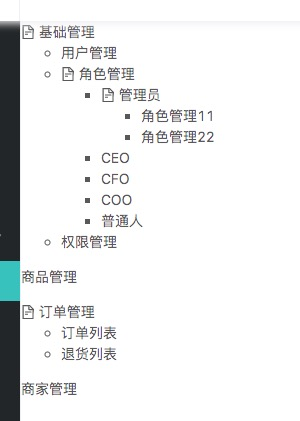

### 谈谈Vue中的递归组件

组件是可以在它们自己的模板中调用自身的。不过它们只能通过 name 选项来做这件事：
```js
  name:'unique-name-of-my-component'
```

一般项目中需要用递归组件生成目录树，废话不多说，咱上个例子吧

* 新建一个sidebar 控件
```html
  <template>
  <div class="main--class">
      <ul
        v-for = '(modelItem, $index) in data'
        :key='$index'
      >
        <tree-menu :model='modelItem'/>
      </ul>
  </div>
</template>
<script>
import TreeMenu from './treeMenu.vue'
var demoData = [
  {
    'id': '1',
    'menuName': '基础管理',
    'menuCode': '10',
    'children': [
      {
        'menuName': '用户管理',
        'menuCode': '11'
      },
      {
        'menuName': '角色管理',
        'menuCode': '12',
        'children': [
          {
            'menuName': '管理员',
            'menuCode': '121',
            'children':[
              {
                'menuName': '角色管理11',
                'menuCode': '124',
              },
              {
                'menuName': '角色管理22',
                'menuCode': '125',
              }
            ]
          },
          {
            'menuName': 'CEO',
            'menuCode': '122'
          },
          {
            'menuName': 'CFO',
            'menuCode': '123'
          },
          {
            'menuName': 'COO',
            'menuCode': '124'
          },
          {
            'menuName': '普通人',
            'menuCode': '124'
          }
        ]
      },
      {
        'menuName': '权限管理',
        'menuCode': '13'
      }
    ]
  },
  {
    'id': '2',
    'menuName': '商品管理',
    'menuCode': ''
  },
  {
    'id': '3',
    'menuName': '订单管理',
    'menuCode': '30',
    'children': [
      {
        'menuName': '订单列表',
        'menuCode': '31'
      },
      {
        'menuName': '退货列表',
        'menuCode': '32',
        'children': []
      }
    ]
  },
  {
    'id': '4',
    'menuName': '商家管理',
    'menuCode': '',
    'children': []
  }
];
export default {
  name: 'demo',
  data() {
    return {
      data:demoData
    }
  },
  components:{
    TreeMenu
  }
}
</script>
```

* 组件 treeMenu

```html
<template>
  <li>
    <span v-if='hasChild'><a-icon type="file-text" /></span>
    <span>{{model.menuName}}</span>
    <ul v-if='hasChild' style='margin-left:20px'>
       <tree-menu 
        style='margin-left:20px'
        v-for="(item,$index) in model.children"  
        :model="item" 
        :key="$index">
       </tree-menu>
    </ul>
  </li>
</template>
<script>
export default {
  name:'TreeMenu',
  props: {
    model: {
      required: true,
      type: Object
    }
  },
 computed:{
   hasChild(){
     return this.model.children && this.model.children.length
    } 
 }
}
</script>
```
ensp;
<font color="#006600">#</font>**注意**
  这个treeMenu组件必须有`name`,因为没有name这个属性会造成控件自身不能调用自身，自身调用的时候最好有绑定key，
因为这个key是唯一标时，对于`vue`更新控件比较好，除非控件非常简单就不用key

  另外一个需要注意就是递归组件时候，需要有一个条件来终止递归，在这里使用 `v-for`隐形条件终止递归，props这个属性其实主要
传递父控件的数据的参数，具体用法可以参详`vue`的官方文档

* 最终结果如下图
